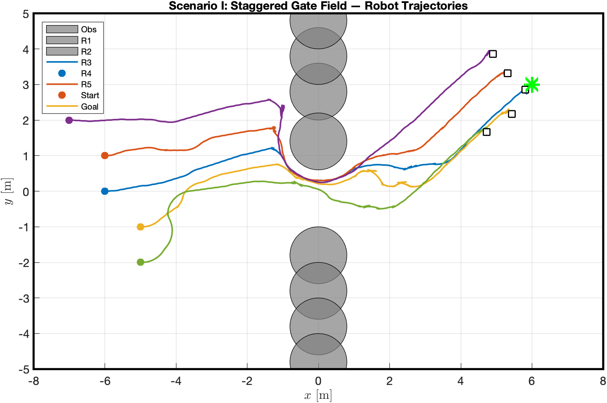
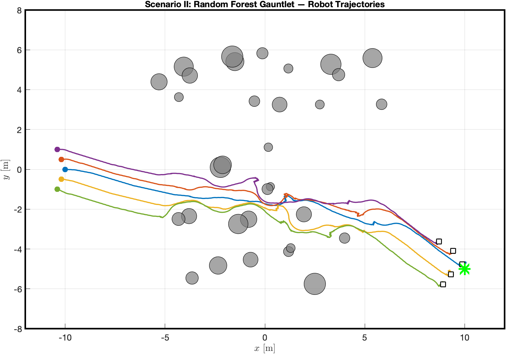
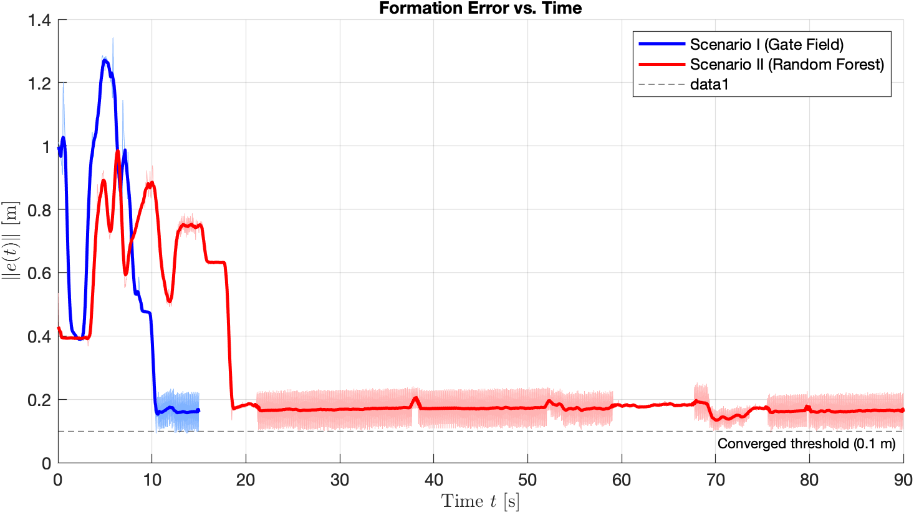
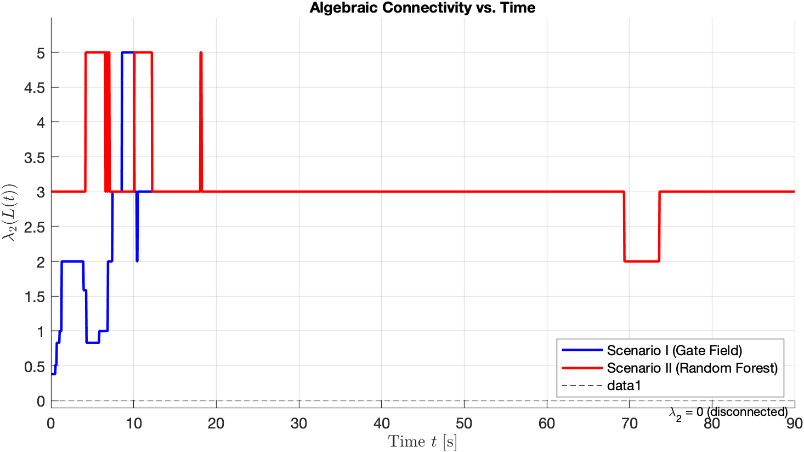

# Vortex Multi-Agent Formation Control

**Connectivity-Preserving V-Formation Control for Unicycle Multi-Robot Systems via Feedback Linearization and Adaptive Artificial Potential Fields**

> &nbsp; [Institute for Control, Optimization and Networks (ICON)](https://engineering.purdue.edu/ICON) &nbsp;|&nbsp; Purdue University

<p align="center">
  
  
  
  
  
</p>

---

## Overview

This project implements a fully decentralized formation controller for five unicycle-type (differential-drive) robots navigating cluttered 2D environments while simultaneously achieving three hard objectives:

- **V-shape formation maintenance** — robots converge to and hold a precise geometric configuration
- **Static obstacle avoidance** — zero collisions with circular obstacles and workspace boundaries
- **Communication connectivity preservation** — the spectral certificate λ₂(L(t)) > 0 is guaranteed at all times

The controller extends the unified Artificial Potential Field (APF) framework of Kan et al. (2012) from point agents to nonholonomic unicycle robots via **feedback linearization**, supported by a formal Lyapunov stability proof. Five novel mechanisms resolve the practical failure modes of rigid APF architectures in highly cluttered environments.

---

## Key Contributions

| Mechanism | Description |
|:---|:---|
| **Feedback Linearization** | Maps each unicycle onto a fully actuated virtual integrator via a look-ahead point, bypassing the Pfaffian nonholonomic constraint and enabling direct gradient-descent control |
| **Dynamic Formation Squeeze** | Adaptively scales the formation gain with local obstacle clearance — collapses to 10% rigidity in tight corridors to eliminate topological deadlock, restores to 100% in open field |
| **Saturated Tangent Barrier** | Zero-drag connectivity preservation: applies no force when agents are safely within range, activates a hard-capped restoring force only as an inter-agent link approaches the communication threshold |
| **Per-Obstacle Vortex Field** | Non-conservative 90° rotation of each repulsive gradient that escapes APF local minima and saddle points provably without breaking the Lyapunov energy-descent guarantee |
| **Leaderless Distributed Tracking** | Each agent independently tracks its own V-shape offset target — eliminates single-point-of-failure and enables automatic sub-swarm reconnection after transient topological splits |

---

## Simulation Results

### Scenario I — Staggered Gate Field

Eight fixed circular obstacles (r = 0.8 m) aligned at x = 0 create a narrow central passage in a 16×10 m workspace. The swarm starts at (−6, 0) m and navigates to the goal while squeezing through the gate and re-establishing the V-formation beyond it.




---

### Scenario II — Random Forest Gauntlet

32 randomly clustered obstacles of mixed radii (0.2–0.55 m) fill the central zone of a 24×16 m workspace. The swarm traverses 20 m from (−10, 0) to (10, 0) m across the full 90 s simulation horizon, maintaining formation throughout.



---

### Formation Error and Algebraic Connectivity

| Formation Error ‖e(t)‖ | Algebraic Connectivity λ₂(L) |
|:---:|:---:|
|  |  |

The formation error is bounded throughout obstacle passages and stabilizes in open regions. The algebraic connectivity remains strictly positive across both scenarios — confirming that the communication graph is never disconnected.

**Numerical results summary:**

| Metric | Scenario I — Gate Field | Scenario II — Random Forest |
|:---|:---:|:---:|
| Peak formation error | 1.34 m | 1.02 m |
| Final formation error | 0.19 m | 0.22 m |
| Minimum λ₂ | 0.38 | 2.00 |
| λ₂ ≤ 0 at any point | ✗ | ✗ |
| Collisions | 0 | 0 |

---

## System Architecture

Each agent runs the same decentralized control loop. Only the positions of current communication neighbors are required — no global state, no central coordinator.

```
┌──────────────────────────────────────────────────────┐
│                 Agent i  (Unicycle Robot)             │
│                                                      │
│   State q_i = [x, y, θ]                             │
│         │                                            │
│         ▼                                            │
│   Look-ahead point  p_{v,i} = [x+l·cosθ, y+l·sinθ]  │
│         │                                            │
│         ▼                                            │
│   ┌─────────────────────────────────────────────┐    │
│   │            Unified APF Controller           │    │
│   │                                             │    │
│   │   u_{v,i} = F_att + F_rep + F_vortex       │    │
│   │           + F_conn + F_squeeze              │    │
│   └─────────────────────────────────────────────┘    │
│         │                                            │
│         ▼                                            │
│   Feedback linearization:  [v, ω] = B(θ)⁻¹ · u_v   │
│         │                                            │
│         ▼                                            │
│   Unicycle dynamics  →  next state q_i               │
└──────────────────────────────────────────────────────┘
          ↕  {p_j : j ∈ N_i(t)}  (neighbor positions only)
```

### Bayesian-Optimized Gain Parameters

Five APF hyperparameters were tuned via **Bayesian optimization over a Gaussian process surrogate** across a multi-scenario gauntlet (staggered gate, two-pillar corridor, S-curve dogleg, dense gate field). The optimizer minimized a cost function penalizing collisions (×50,000), network disconnections (×500,000), and cumulative formation error.

| k\_form | k\_att | k\_rep | k\_vortex | k\_conn |
|:---:|:---:|:---:|:---:|:---:|
| 26.327 | 32.240 | 2.100 | 0.214 | 17.679 |

---

## Project Structure

```
Vortex-Multiagent-Formation-Control/
│
├── 10_Documentation/
│   └── FinalPaper/
│       ├── FInalReport.tex              # IEEE journal paper (LaTeX source)
│       └── MAAC_Paper.bib               # Bibliography — 13 verified entries
│
├── 20_Core_Math/
│   ├── compute_laplacian.m              # Graph Laplacian L and λ₂ eigenvalue
│   ├── compute_multiagent_fc_apf.m      # Full APF controller (all five forces)
│   ├── compute_multiagent_apf.m         # Baseline APF (no feedback linearization)
│   └── unicycle_dynamics.m              # Unicycle kinematics with velocity saturation
│
├── 30_Simulation_Scenarios/
│   ├── main_milestone_1.m               # Single-robot APF baseline
│   ├── main_milestone_2.m               # Multi-robot formation, no obstacles
│   ├── main_milestone_3.m               # Staggered gate scenario (Scenario I)
│   ├── main_milestone_4.m               # Random forest scenario (Scenario II)
│   └── main_results_generator.m         # Automated figure + results generator
│
├── 40_Utilities/
│   ├── generate_clustered_obstacles.m   # Bimodal gap-safe random obstacle generator
│   ├── animate_robots.m                 # Real-time trajectory animation
│   ├── plot_environment.m               # Static environment visualization
│   └── plot_vector_field.m              # APF vector field overlay
│
├── 50_Optimization/
│   ├── run_bayesian_tuner.m             # Bayesian optimization (GP surrogate)
│   ├── run_pso_tuner.m                  # Alternative PSO tuner
│   └── evaluate_formation_cost.m        # Multi-scenario cost function J
│
└── 60_Results/
    ├── fig1_trajectory_gate.pdf         # Scenario I trajectory (vector PDF)
    ├── fig2_trajectory_forest.pdf       # Scenario II trajectory (vector PDF)
    ├── fig3_formation_error.pdf         # Formation error ‖e(t)‖ time-series
    ├── fig4_lambda2.pdf                 # Algebraic connectivity λ₂ time-series
    ├── results_summary.txt              # Numerical results for paper Table
    └── readme_figs/                     # PNG exports for this README
```

---

## Requirements

- **MATLAB R2020a or newer** — required for `exportgraphics(..., 'ContentType','vector')` PDF export
- **Statistics and Machine Learning Toolbox** — required for `bayesopt` in the Bayesian tuner
- No external dependencies — all core math is self-contained MATLAB

---

## Usage

**Generate all publication figures and results summary:**
```matlab
cd 30_Simulation_Scenarios
main_results_generator
% → saves fig1–fig4 as vector PDFs + results_summary.txt to 60_Results/
```

**Run Bayesian hyperparameter optimization:**
```matlab
cd 50_Optimization
run_bayesian_tuner
% → optimizes [k_form, k_att, k_rep, k_vortex, k_conn] over GP surrogate
```

**Animate a specific scenario:**
```matlab
cd 30_Simulation_Scenarios
main_milestone_4    % Scenario II — Random Forest Gauntlet, animated
main_milestone_3    % Scenario I  — Staggered Gate Field, animated
```

**Reproduce incremental development milestones:**
```matlab
main_milestone_1    % Single robot, APF baseline
main_milestone_2    % Multi-robot, no obstacles
main_milestone_3    % Obstacle avoidance + formation
main_milestone_4    % Full system: connectivity + vortex field
```

---

## Paper

The full IEEE-format journal paper is included in the repository:

📄 [`10_Documentation/FinalPaper/FInalReport.tex`](10_Documentation/FinalPaper/FInalReport.tex)

**Title:** *Connectivity-Preserving V-Formation Control for Unicycle Multi-Robot Systems via Feedback Linearization and Adaptive Artificial Potential Fields*

**Author:** Phillipp Gery
**Affiliation:** Institute for Control, Optimization and Networks (ICON), Purdue University, West Lafayette, IN 47907, USA

---

*Institute for Control, Optimization and Networks (ICON) · Purdue University*
